# ATLAS Oracle Tracker

Live hindsight-**oracle** analytics for 13 liquid USDC perpetuals,
refreshed automatically by GitHub Actions from public exchange candle
data.

The **oracle** for a window is the best trade that existed in hindsight:
buy at the lowest hourly low, sell at the highest hourly high after it.
Comparing today's oracle against buy&hold shows how much opportunity the
week actually contained, per coin — a benchmark for any systematic
strategy.

> These numbers are computed with hindsight and are **not investable**.
> Nothing here is financial advice.

**Last update:** Aug 29 2026 19:57 UTC — 13/13 coins rendered

| Pair | 24h oracle | 7d oracle | 7d buy&hold | oracle window |
|---|---|---|---|---|
| BTC-USDC | +1.4% | +7.9% | +1.1% | Aug 23 05:00 → Aug 28 01:00 UTC |
| ETH-USDC | +1.5% | +9.0% | +0.9% | Aug 23 05:00 → Aug 27 09:00 UTC |
| XRP-USDC | +2.5% | +8.7% | -7.0% | Aug 26 15:00 → Aug 27 16:00 UTC |
| SOL-USDC | +3.1% | +20.9% | +11.6% | Aug 23 05:00 → Aug 27 22:00 UTC |
| ZEC-USDC | +7.6% | +16.1% | -0.2% | Aug 23 04:00 → Aug 23 18:00 UTC |
| ADA-USDC | +2.0% | +8.2% | -12.6% | Aug 23 05:00 → Aug 23 14:00 UTC |
| XLM-USDC | +2.1% | +7.7% | -10.0% | Aug 23 06:00 → Aug 23 21:00 UTC |
| LTC-USDC | +1.2% | +6.9% | -7.7% | Aug 23 05:00 → Aug 24 10:00 UTC |
| LINK-USDC | +1.9% | +9.4% | -2.4% | Aug 23 05:00 → Aug 28 01:00 UTC |
| NEAR-USDC | +4.9% | +15.0% | -4.9% | Aug 23 05:00 → Aug 24 00:00 UTC |
| DOGE-USDC | +1.8% | +7.8% | -9.6% | Aug 26 15:00 → Aug 28 01:00 UTC |
| ONDO-USDC | +2.4% | +14.6% | -5.7% | Aug 23 05:00 → Aug 25 02:00 UTC |
| SUI-USDC | +2.4% | +10.4% | -10.1% | Aug 26 15:00 → Aug 28 01:00 UTC |

## Charts (7-day window, oracle entry/exit marked)

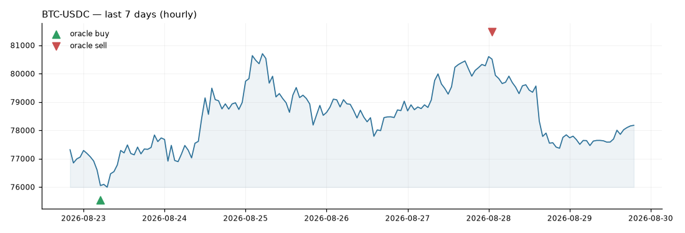

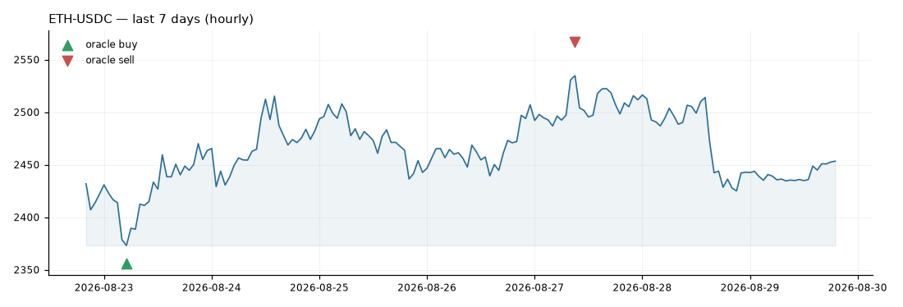

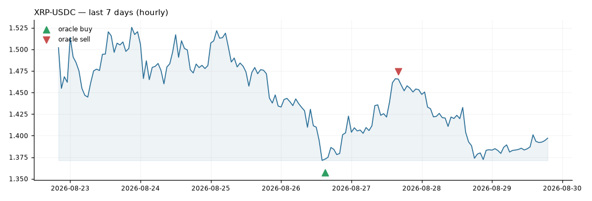

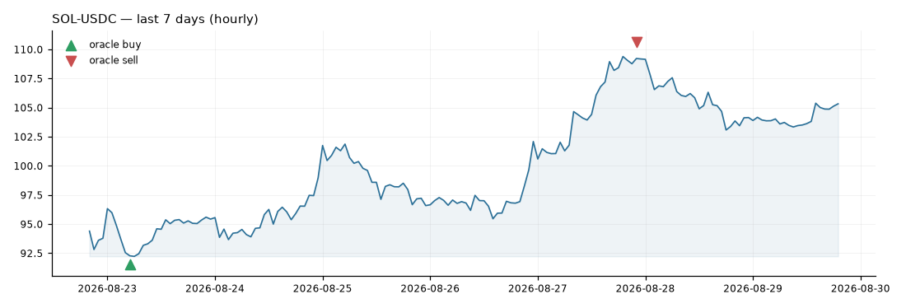

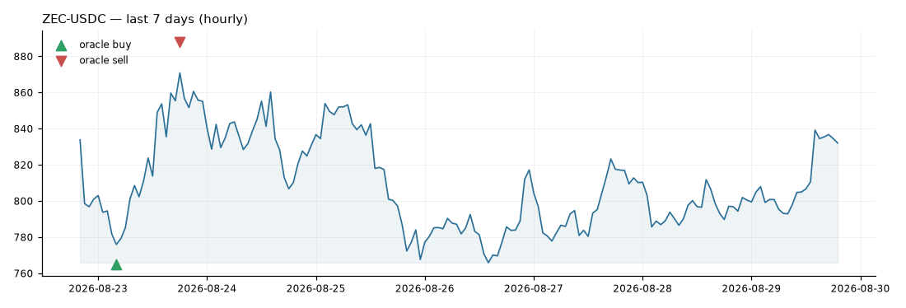

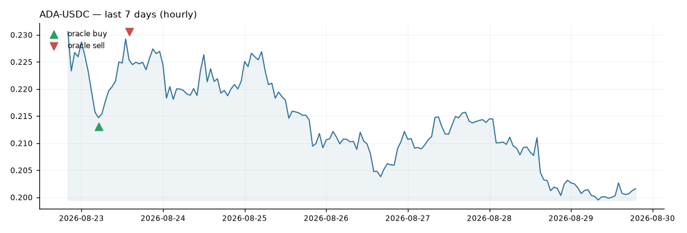

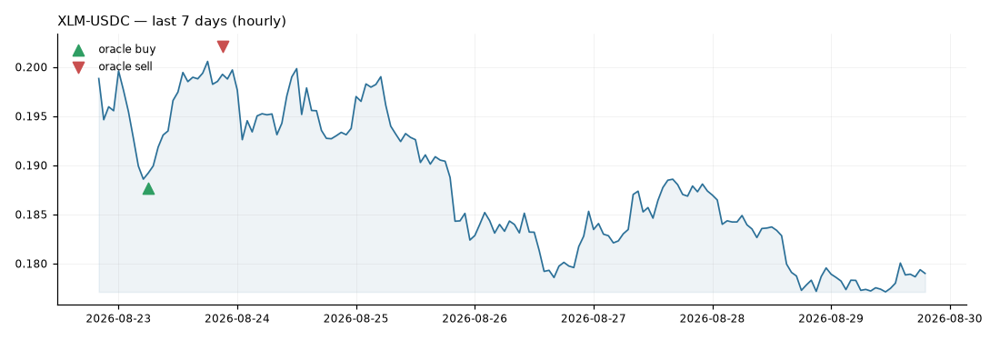

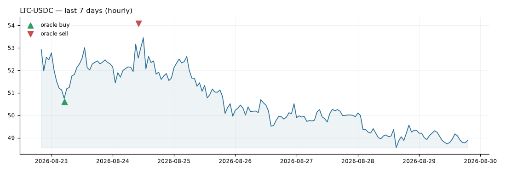

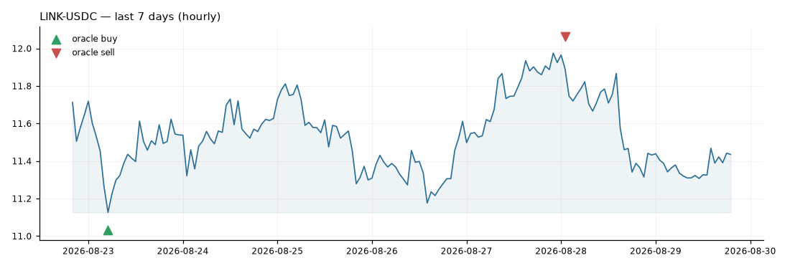

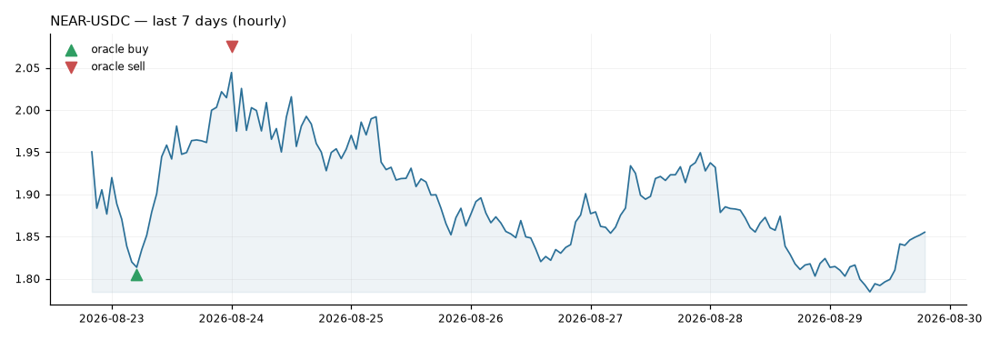

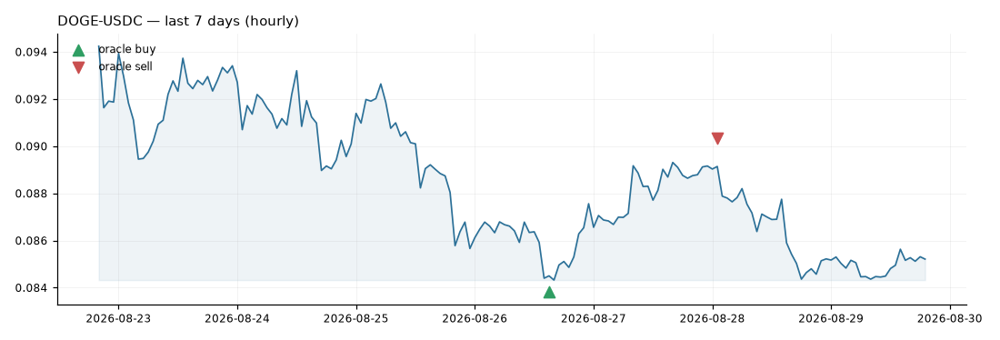

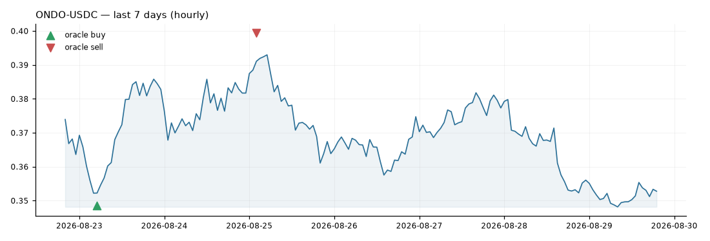

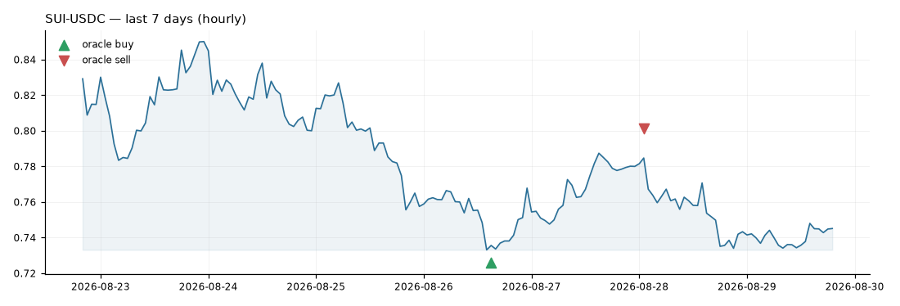

