# ATLAS Oracle Tracker

Live hindsight-**oracle** analytics for 13 liquid USDC perpetuals,
refreshed automatically by GitHub Actions from public exchange candle
data.

The **oracle** for a window is the best trade that existed in hindsight:
buy at the lowest hourly low, sell at the highest hourly high after it.
Comparing today's oracle against buy&hold shows how much opportunity the
week actually contained, per coin — a benchmark for any systematic
strategy.

> These numbers are computed with hindsight and are **not investable**.
> Nothing here is financial advice.

**Last update:** Oct 02 2026 17:09 UTC — 13/13 coins rendered

| Pair | 24h oracle | 7d oracle | 7d buy&hold | oracle window |
|---|---|---|---|---|
| BTC-USDC | +3.7% | +5.7% | +1.6% | Sep 28 14:00 → Oct 02 12:00 UTC |
| ETH-USDC | +3.7% | +5.4% | +0.1% | Sep 28 05:00 → Oct 02 08:00 UTC |
| XRP-USDC | +5.1% | +6.5% | -4.2% | Sep 29 01:00 → Sep 29 14:00 UTC |
| SOL-USDC | +5.7% | +6.4% | -1.2% | Sep 29 01:00 → Oct 02 05:00 UTC |
| ZEC-USDC | +8.4% | +11.8% | -11.0% | Sep 25 17:00 → Sep 26 21:00 UTC |
| ADA-USDC | +6.2% | +8.5% | -1.0% | Sep 29 02:00 → Oct 02 12:00 UTC |
| XLM-USDC | +4.8% | +14.6% | +1.6% | Sep 28 07:00 → Sep 29 11:00 UTC |
| LTC-USDC | +6.6% | +8.8% | -0.1% | Sep 30 18:00 → Oct 02 14:00 UTC |
| LINK-USDC | +7.3% | +16.7% | +2.6% | Sep 28 09:00 → Sep 29 00:00 UTC |
| NEAR-USDC | +6.7% | +21.8% | -3.5% | Sep 29 03:00 → Oct 01 06:00 UTC |
| DOGE-USDC | +5.1% | +7.2% | -2.4% | Sep 28 14:00 → Sep 30 13:00 UTC |
| ONDO-USDC | +6.4% | +15.2% | -7.0% | Sep 27 04:00 → Sep 28 04:00 UTC |
| SUI-USDC | +6.3% | +17.1% | +3.7% | Sep 25 17:00 → Sep 27 21:00 UTC |

## Charts (7-day window, oracle entry/exit marked)

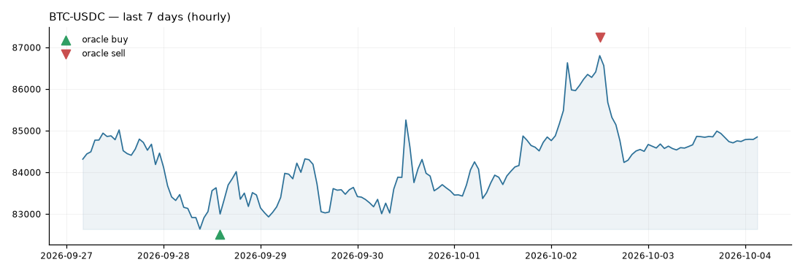

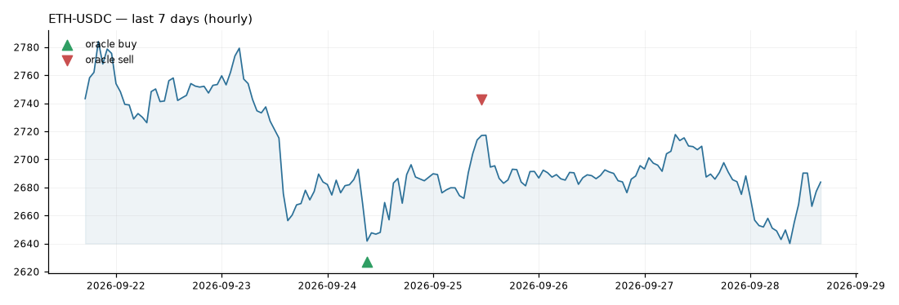

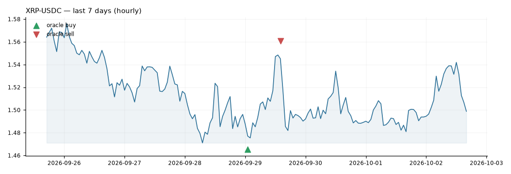

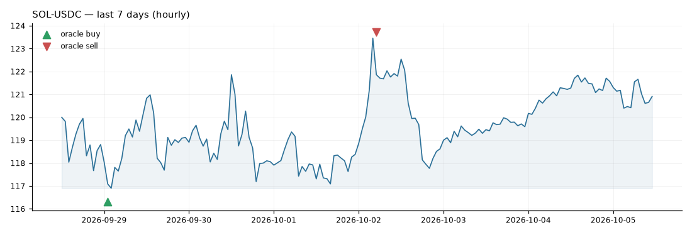

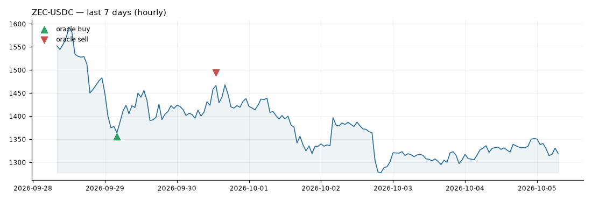

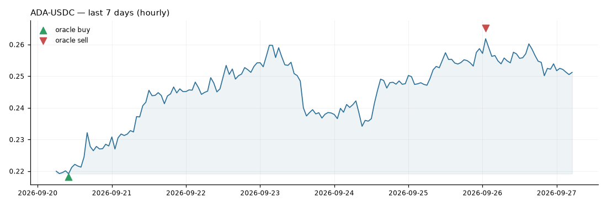

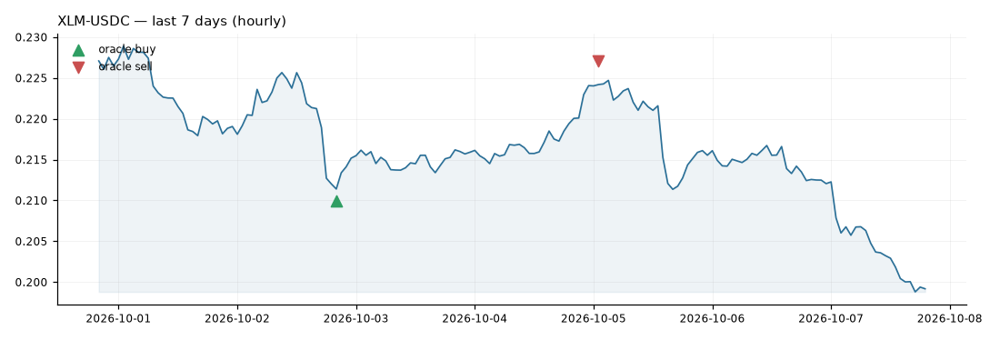

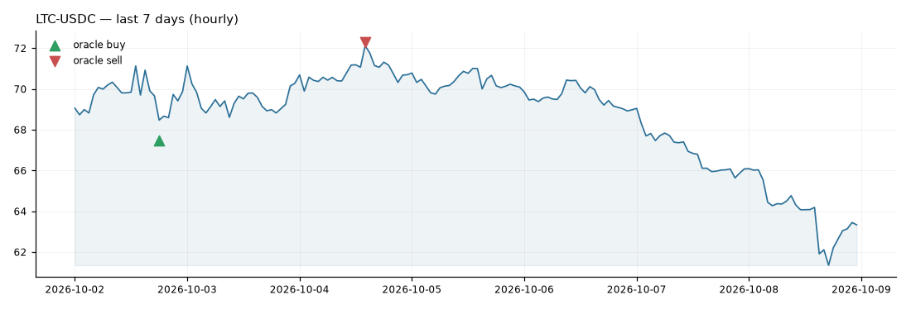

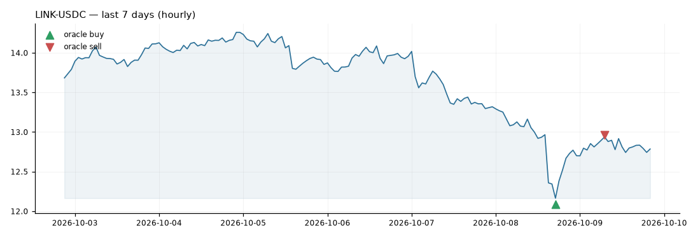

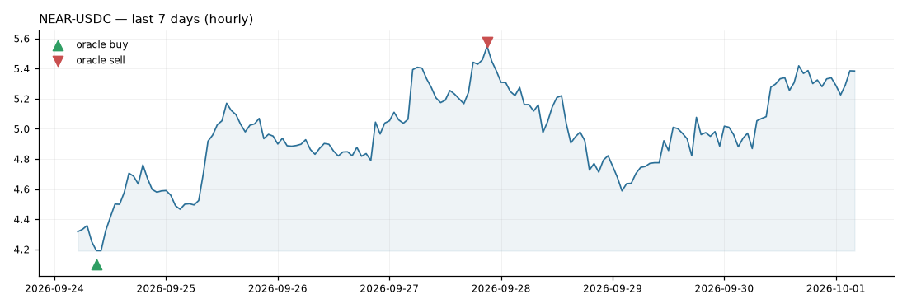

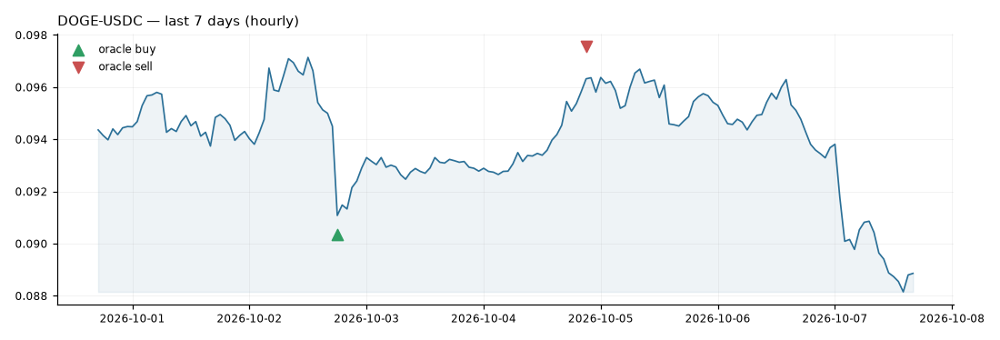

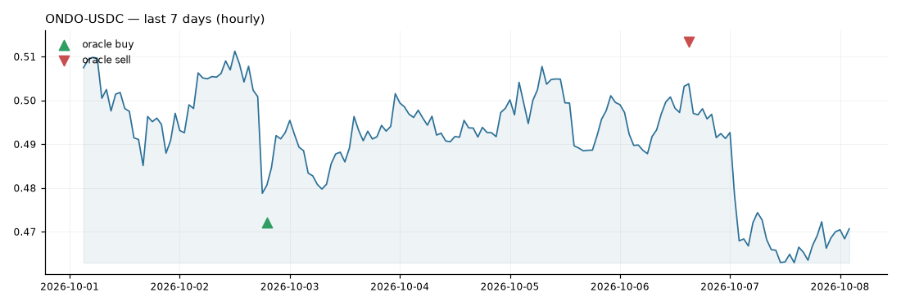

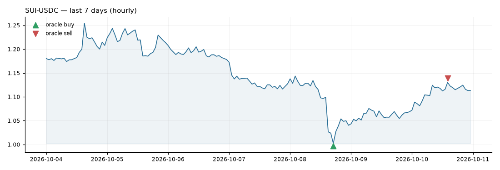

