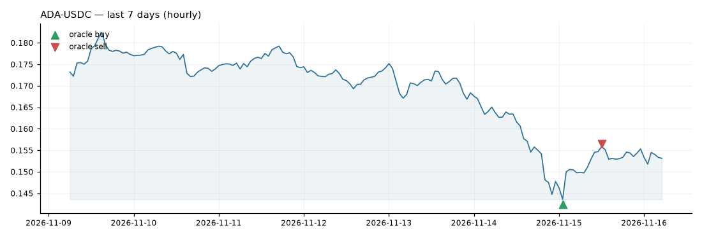
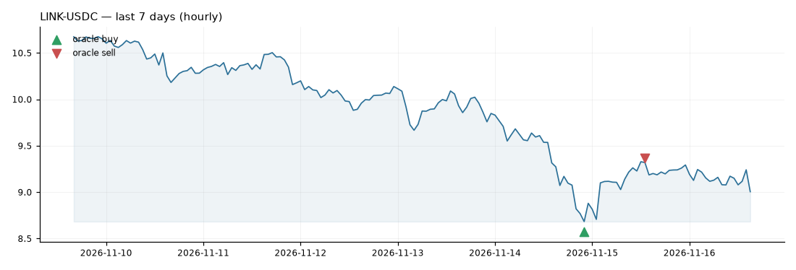

# ATLAS Oracle Tracker

Live hindsight-**oracle** analytics for 13 liquid USDC perpetuals,
refreshed automatically by GitHub Actions from public exchange candle
data.

The **oracle** for a window is the best trade that existed in hindsight:
buy at the lowest hourly low, sell at the highest hourly high after it.
Comparing today's oracle against buy&hold shows how much opportunity the
week actually contained, per coin — a benchmark for any systematic
strategy.

> These numbers are computed with hindsight and are **not investable**.
> Nothing here is financial advice.

**Last update:** Nov 16 2026 05:29 UTC — 13/13 coins rendered

| Pair | 24h oracle | 7d oracle | 7d buy&hold | oracle window |
|---|---|---|---|---|
| BTC-USDC | +3.7% | +6.7% | -12.9% | Nov 15 01:00 → Nov 15 09:00 UTC |
| ETH-USDC | +4.1% | +7.9% | -14.2% | Nov 15 01:00 → Nov 15 09:00 UTC |
| XRP-USDC | +3.8% | +9.8% | -12.4% | Nov 14 23:00 → Nov 15 04:00 UTC |
| SOL-USDC | +5.5% | +8.7% | -17.1% | Nov 15 01:00 → Nov 15 13:00 UTC |
| ZEC-USDC | +5.0% | +16.2% | -27.0% | Nov 14 21:00 → Nov 15 03:00 UTC |
| ADA-USDC | +5.5% | +9.9% | -11.6% | Nov 15 01:00 → Nov 15 12:00 UTC |
| XLM-USDC | +4.1% | +9.1% | -4.2% | Nov 15 01:00 → Nov 15 23:00 UTC |
| LTC-USDC | +3.3% | +7.4% | -11.0% | Nov 15 01:00 → Nov 15 10:00 UTC |
| LINK-USDC | +4.3% | +9.3% | -11.6% | Nov 14 22:00 → Nov 15 13:00 UTC |
| NEAR-USDC | +5.0% | +13.0% | -10.5% | Nov 14 21:00 → Nov 15 23:00 UTC |
| DOGE-USDC | +5.3% | +8.5% | -14.5% | Nov 14 22:00 → Nov 15 23:00 UTC |
| ONDO-USDC | +5.0% | +13.2% | -13.2% | Nov 09 07:00 → Nov 09 16:00 UTC |
| SUI-USDC | +4.6% | +9.5% | -11.8% | Nov 14 22:00 → Nov 15 23:00 UTC |

## Charts (7-day window, oracle entry/exit marked)

